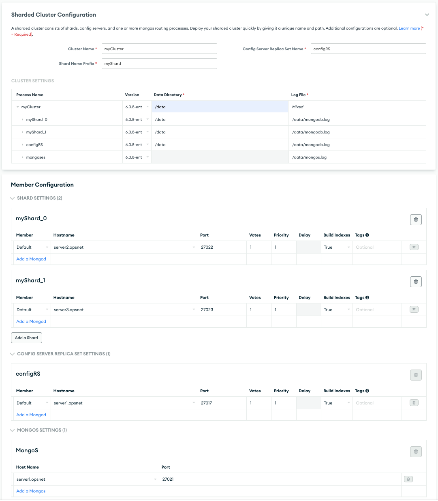
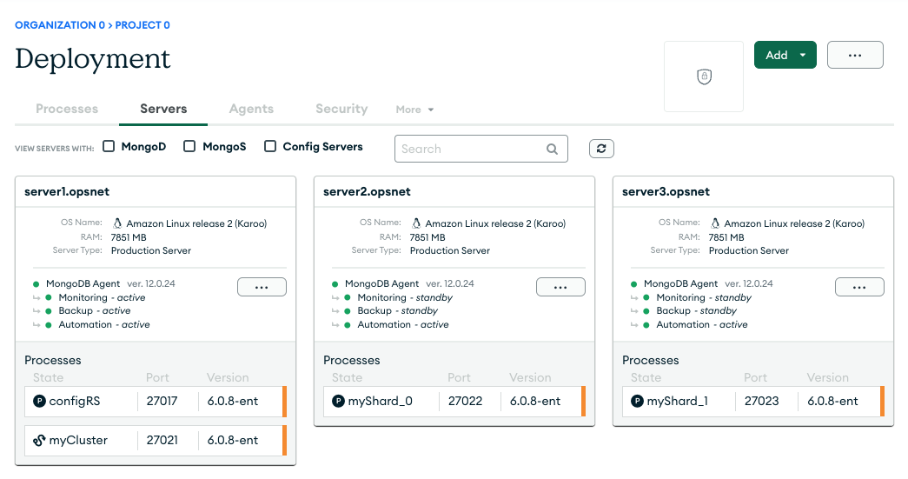

# MongoDB Ops Manager Administration API

A sample Node.js application to deploy a MongoDB cluster using the Ops Manager Administration API. API documentation can be found [here](https://www.mongodb.com/docs/ops-manager/current/api/).


## Prerequisites

- Node.js and NPM (Node Package Manager)
- Ops Manager must be deployed in advance. The included cluster configuration assumes an Ops Manager demonstration environment has been provisioned using the Docker scripts provided in this repo. 


## Deploying a Cluster

### 1. Download the Repository

```
git clone https://github.com/janosj/mongodb-opsmgr.git
```

### 2. Install Dependencies

Navigate to the directory containing the project in your shell, and then use the NPM dependency file that we included in the project directory called `package.json` to download and install your dependencies:

```shell
npm install
```

This command reads the `package.json` file and downloads and saves the
dependencies defined within it to a directory called `node_modules`. It
also creates a `package-lock.json` file that sets the version information for
each of the modules required to build your project.

### 3. Configure your Ops Manager Settings

The `deployShardeCluster.js` files contains a number of settings required by the API to connect to your Ops Manager instance and deploy resources. Be sure to update the OPSMGR_HOST, PROJECT_ID, OM_USER, and PUBLIC_API_KEY accordingly. Also note that cluster configuration file contains hardcoded server names. You can either deploy a 3-node Ops Manager system using the included scripts (for running a Docker demonstration environment) or adjust the configuration file to match your environment.

### 4. Deploy the Cluster

Deploy the cluster by running the Node.js application:

```shell
node deployShardedCluster.js
```

> node deployShardedCluster.js

The application should return immediately, and the cluster should be listed immediately in the Deployment section of Ops Manager. In a few seconds or minutes, the cluster will be deployed, primaries will be elected, and the cluster will become available for use. 

## Example Cluster Configuration

The example configuration is a Sharded cluster containing 2 shards, using single-node replica sets for both shards as well as the Config Server Replica Set. This was designed to consume a minimum of resources for demonstration purposes only and should not be used in production. The config file was generated by exporting the configuration of a deployed cluster. Using the Ops Manager UI, the deployment of this cluster would look as follows:



The deployed cluster would look like this:




